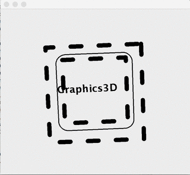

Graphics3D
==========
A lightweight extension to `java.awt.Graphics2D` featuring OpenGL-style 3D transformations and primitives.

Project status: actively maintained. Target Java 8 (compiled via Gradle toolchains). No external `vecmath` dependency.

Introduction
------------
Graphics3D lets you render simple 3D content using the familiar `java.awt.Graphics2D` API. Instead of pulling in a full 3D engine or binding to native OpenGL, you can keep your Swing/AWT pipeline and still get perspective-correct transformations, 3D primitives, and projective texture mapping. The library focuses on being small, dependency-free, and easy to drop into existing desktop apps, editors, visualizers, or educational demos.

Key ideas:
- Works with `Graphics2D`: you construct a `Graphics3D` wrapper around your existing `Graphics` and keep drawing on any `Component`.
- 3D transforms in immediate mode: set `viewport`/`projection`, then `translate`/`rotate`/`scale` and emit vertices with `begin()`/`vertex()`/`end()`.
- Mix 2D and 3D: after positioning your camera, you can draw regular `Java2D` Shapes and text in the same scene with projective transforms applied.
- No native code, no heavyweight window: everything is CPU-side and integrates with Swing’s `paintComponent`.
- Predictable and small footprint: internal math types (`Matrix4f`/`Matrix4d`/`Vector4f`/`Vector4d`, `AxisAngle4d`) replace the old `javax.vecmath` dependency.

Use it when you want quick 3D visuals in an AWT/Swing application without switching renderers. It’s great for UI overlays, simple editors, teaching, or data visualization where control and portability matter more than raw GPU throughput.

How to use
----------

This section shows a minimal Swing `paintComponent` example and explains the main steps: set up the viewport and projection, position the camera, emit 3D primitives, and mix regular Java2D drawing—all within the familiar `Graphics2D` pipeline.

Walkthrough:
- Create the wrapper: `new Graphics3D(g)` adapts your `Graphics2D` to support 3D operations while keeping the same rendering target.
- Viewport: `viewport(x, y, w, h)` maps normalized device coordinates to your component’s pixel rectangle.
- Projection: `frustum(l, r, t, b, n, f)` sets a perspective frustum (OpenGL-style) with near/far planes; use the aspect ratio `r = height/width` to avoid stretching.
- Camera/model transforms: `translate`/`rotate`/`scale` change the current 3D transform. Order matters; think camera first, then model.
- Immediate-mode primitives: `begin(Graphics3D.QUADS|TRIANGLES|LINES)` … `vertex(x,y,z)` … `end()` emits geometry in the current transform and projection.
- Mix 2D and 3D: you can draw Java2D Shapes (e.g., `RoundRectangle2D`) and text in the same pass; they are transformed projectively when using `TransformedShape` or via `Graphics3D` helpers.
- Cleanup: `dispose()` releases the wrapper (similar to `Graphics2D` usage). Repaint to animate.
- Tip: Z forward is negative in the sample; translating by `-5` moves the object into view. Content behind the near plane is clipped.

Below is a full example:

Imagine a suspiciously familiar looking `JComponent`'s `paintComponent` method like this ...

	protected void paintComponent(Graphics g) {
		Graphics3D g3 = new Graphics3D(g);
		g3.setStroke(new BasicStroke(10,1,1,1,new float[]{ 25,40 },0));
		
		double r = getHeight()*1.0/getWidth();
		g3.viewport(0, 0, getWidth(), getHeight());
		g3.frustum(-1, 1, +r, -r, 2, 100);
		
		g3.translate(0, 0, -5);

		double degrees = System.nanoTime()/1e9;
		g3.rotate(degrees, 1, 0, 0);
		g3.rotate(degrees, 0, 0, 1);

		g3.begin(Graphics3D.QUADS);
			g3.vertex(-1, -1, -1);
			g3.vertex( 1, -1, -1);
			g3.vertex( 1,  1, -1);
			g3.vertex(-1,  1, -1);

			g3.vertex(-1, -1, +1);
			g3.vertex( 1, -1, +1);
			g3.vertex( 1,  1, +1);
			g3.vertex(-1,  1, +1);
		g3.end();
		
		g3.setStroke(new BasicStroke(2));		
		g3.draw(new RoundRectangle2D.Double(-1, -1, 2, 2, 0.5, 0.5));
		
		g3.scale(0.02, 0.02);
		g3.setFont(g3.getFont().deriveFont(Font.BOLD));
		g3.drawString("Graphics3D", -50, 0);
		
		g3.dispose();
		repaint();
	}
		
... would yield this  

Recent releases
---------------
- 1.5.0 (2025-09-08)
  - Release to Maven Central
  - Removal of old CI/CD ymls
- 1.4.0 (2025-09-07)
  - Removed `javax.vecmath` dependency; replaced with internal math (`Matrix4f`/`Matrix4d`/`Vector4f`/`Vector4d`, `AxisAngle4d`).
  - Switched build to Gradle and reorganized sources into standard directories.
  - Updated package path to `io.github.dualuse.*` and added texture demo.
  - Perspective texture drawing: add recursion limit to improve performance and avoid runaway subdivision.
  - Increased test coverage (math and core components).
- 1.3.x (2017-01-18)
  - Simplified project structure and migrated publishing to dualuse.github.io's Maven repo.
  - Fixed deployment configuration and adjusted `vecmath` dependency version.

How to add to your project (Gradle Kotlin DSL, Maven Central)
------------------------------------------------------------
Add Maven Central and the dependency:

repositories {
    mavenCentral()
}

dependencies {
    // Replace 1.4.0 with the latest released version
    implementation("io.github.dualuse:Graphics3D:1.4.0")
}

How to compile
--------------
Prerequisites: JDK 8+.

Build everything (compile + tests):

    ./gradlew build

Run tests only:

    ./gradlew test

Generate wrapper scripts again (if needed):

    ./gradlew wrapper --gradle-version 8.14.2

Contributing
------------
Contributions are welcome! Feel free to open issues and pull requests. Please run the test suite before submitting changes.

License
-------
LGPL-3.0-or-later. See LICENSE and the header in each source file. Graphics3D is distributed in the hope that it will be useful, but without any warranty; see the GNU LGPL for details.

